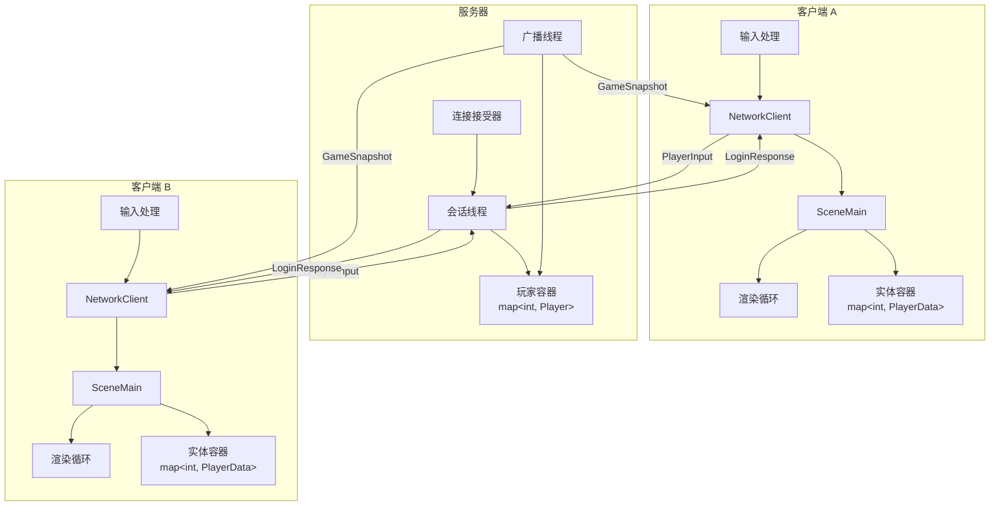
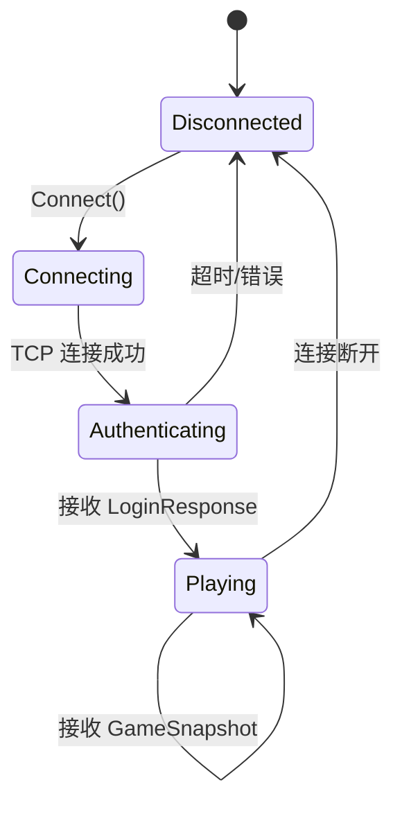

# 设计文档

## 概述

本设计实现多人在线飞机游戏的客户端-服务器同步机制。系统采用服务器权威架构，服务器维护游戏世界的唯一真实状态，客户端作为"瘦客户端"接收输入并渲染服务器广播的状态。

核心设计包含三个主要组件：

1. **协议扩展**: 在现有 Protobuf 协议中添加 LoginResponse 消息，支持服务器向客户端分配唯一 ID
2. **客户端实体管理**: 引入 PlayerData 结构和 std::map 容器来存储和管理所有远程玩家状态
3. **多玩家渲染**: 扩展渲染循环以绘制本地玩家和所有远程玩家

设计遵循以下原则：
- 服务器权威：所有玩家位置由服务器计算和广播
- 最小化客户端逻辑：客户端仅负责输入采集和状态渲染
- 线程安全：网络接收和游戏循环在不同线程，使用互斥锁保护共享数据
- 向后兼容：扩展现有协议而非重写

## 架构

### 系统架构图



### 数据流

**连接建立流程:**
```
1. 客户端 -> 服务器: TCP 连接请求
2. 服务器: 分配玩家 ID (g_next_id++)
3. 服务器 -> 客户端: LoginResponse { player_id: N }
4. 客户端: 存储 my_player_id = N
5. 服务器: 启动会话线程接收该客户端输入
6. 服务器: 将玩家添加到 g_players 容器
```

**游戏循环数据流:**
```
客户端输入 -> NetworkClient::SendInput() -> 服务器会话线程
                                                    |
                                                    v
                                            更新 g_players[id] 位置
                                                    |
                                                    v
                                            广播线程每 33ms 打包
                                                    |
                                                    v
                                            GameSnapshot -> 所有客户端
                                                    |
                                                    v
                                            NetworkClient::ReceiveThread()
                                                    |
                                                    v
                                            SceneMain::update() 读取快照
                                                    |
                                                    v
                                            更新本地玩家 + 实体容器
                                                    |
                                                    v
                                            SceneMain::render() 绘制所有玩家
```

### 线程模型

**服务器端:**
- 主线程: 接受新连接，为每个连接创建会话线程
- 会话线程 (每个客户端一个): 接收 PlayerInput，更新 g_players
- 广播线程: 每 33ms 打包 GameSnapshot 并发送给所有客户端

**客户端:**
- 主线程: 游戏循环 (输入处理、update、render)
- 接收线程: 持续接收网络数据，解析并更新 current_snapshot_

**同步机制:**
- 服务器: std::mutex g_mutex 保护 g_players 容器
- 客户端: std::mutex data_mutex_ 保护 current_snapshot_

## 组件和接口

### 1. 协议定义 (game.proto)

**新增消息类型:**

```protobuf
// 登录响应 (服务端 -> 客户端，连接建立时发送一次)
message LoginResponse {
    int32 player_id = 1;  // 服务器分配的唯一玩家 ID
}
```

**现有消息 (保持不变):**
- `PlayerInput`: 客户端发送的输入指令
- `PlayerState`: 单个玩家的状态快照
- `GameSnapshot`: 包含所有玩家状态的世界快照

**消息发送顺序:**
1. 服务器 -> 客户端: LoginResponse (连接时一次)
2. 客户端 -> 服务器: PlayerInput (每次按键)
3. 服务器 -> 客户端: GameSnapshot (每 33ms 广播)

### 2. 客户端数据结构

**PlayerData 结构:**

```cpp
struct PlayerData {
    int id;
    float x;
    float y;
    float angle;
    
    // 从 Protobuf 消息构造
    PlayerData(const game::PlayerState& state) 
        : id(state.id()), x(state.x()), y(state.y()), angle(state.angle()) {}
    
    // 更新方法
    void Update(const game::PlayerState& state) {
        x = state.x();
        y = state.y();
        angle = state.angle();
    }
};
```

**SceneMain 类扩展:**

```cpp
class SceneMain : public Scene {
private:
    Player player;  // 本地玩家 (现有)
    
    // 新增成员
    int my_player_id = -1;  // 本地玩家 ID (-1 表示未认证)
    std::map<int, PlayerData> remote_players;  // 远程玩家容器
    SDL_Texture* remote_player_texture = nullptr;  // 远程玩家纹理
    
    // 新增方法
    void UpdateRemotePlayers(const game::GameSnapshot& snapshot);
    void RenderRemotePlayers();
};
```

### 3. NetworkClient 扩展

**接口扩展:**

```cpp
class NetworkClient {
public:
    // 新增方法
    int GetMyPlayerId() const;  // 获取本地玩家 ID
    bool IsAuthenticated() const;  // 是否已认证
    
private:
    int my_player_id_ = -1;  // 本地玩家 ID
    bool authenticated_ = false;  // 认证状态
    
    // 修改接收线程以处理 LoginResponse
    void ReceiveThread();
};
```

**ReceiveThread 修改逻辑:**

```cpp
void NetworkClient::ReceiveThread() {
    try {
        // 首先接收 LoginResponse
        char data[4096];
        size_t len = socket_.read_some(boost::asio::buffer(data));
        
        game::LoginResponse login_resp;
        if (login_resp.ParseFromArray(data, len)) {
            std::lock_guard<std::mutex> lock(data_mutex_);
            my_player_id_ = login_resp.player_id();
            authenticated_ = true;
        }
        
        // 然后循环接收 GameSnapshot
        while (true) {
            len = socket_.read_some(boost::asio::buffer(data));
            game::GameSnapshot snapshot;
            if (snapshot.ParseFromArray(data, len)) {
                std::lock_guard<std::mutex> lock(data_mutex_);
                current_snapshot_ = snapshot;
            }
        }
    } catch (...) {}
}
```

### 4. 服务器端修改

**session 函数修改:**

```cpp
void session(std::shared_ptr<tcp::socket> socket) {
    int my_id = 0;
    try {
        // 1. 分配 ID
        {
            std::lock_guard<std::mutex> lock(g_mutex);
            my_id = g_next_id++;
            auto player = std::make_shared<Player>();
            player->id = my_id;
            player->socket = socket;
            g_players[my_id] = player;
        }
        
        // 2. 发送 LoginResponse
        game::LoginResponse login_resp;
        login_resp.set_player_id(my_id);
        std::string data;
        login_resp.SerializeToString(&data);
        boost::asio::write(*socket, boost::asio::buffer(data));
        
        std::cout << "[Server] Player " << my_id << " joined!" << std::endl;
        
        // 3. 循环接收 PlayerInput (现有逻辑保持不变)
        while (true) {
            // ... 现有输入处理代码 ...
        }
    } catch (...) {
        // ... 现有错误处理 ...
    }
}
```

## 数据模型

### 客户端状态机



**状态说明:**
- **Disconnected**: 未连接，my_player_id = -1
- **Connecting**: TCP 连接建立中
- **Authenticating**: 等待 LoginResponse
- **Playing**: 已认证，正常游戏循环

### 实体容器数据模型

**容器类型:** `std::map<int, PlayerData>`

**键:** 玩家 ID (int)
**值:** PlayerData 结构

**操作:**
- **插入/更新**: 当 GameSnapshot 包含新的或已存在的玩家 ID
- **删除**: 当 GameSnapshot 不再包含某个玩家 ID
- **查询**: 渲染循环遍历所有条目

**同步策略:**
```cpp
void SceneMain::UpdateRemotePlayers(const game::GameSnapshot& snapshot) {
    // 1. 收集快照中的所有 ID
    std::set<int> snapshot_ids;
    for (const auto& ps : snapshot.players()) {
        snapshot_ids.insert(ps.id());
        
        // 跳过本地玩家
        if (ps.id() == my_player_id) {
            player.position.x = ps.x();
            player.position.y = ps.y();
            continue;
        }
        
        // 更新或插入远程玩家
        auto it = remote_players.find(ps.id());
        if (it != remote_players.end()) {
            it->second.Update(ps);
        } else {
            remote_players.emplace(ps.id(), PlayerData(ps));
        }
    }
    
    // 2. 移除不在快照中的玩家
    for (auto it = remote_players.begin(); it != remote_players.end();) {
        if (snapshot_ids.find(it->first) == snapshot_ids.end()) {
            it = remote_players.erase(it);
        } else {
            ++it;
        }
    }
}
```

### 渲染数据流

```
GameSnapshot (网络线程)
    |
    v
current_snapshot_ (互斥锁保护)
    |
    v
SceneMain::update() 调用 GetState()
    |
    v
UpdateRemotePlayers() 更新容器
    |
    v
SceneMain::render()
    |
    +-> RenderLocalPlayer()
    |
    +-> RenderRemotePlayers() 遍历 remote_players
```


## 正确性属性

*属性是一个特征或行为，应该在系统的所有有效执行中保持为真——本质上是关于系统应该做什么的形式化陈述。属性作为人类可读规范和机器可验证正确性保证之间的桥梁。*

### 属性 1: 服务器分配唯一玩家 ID

*对于任何* 一组并发的客户端连接，服务器分配给每个客户端的玩家 ID 都应该是唯一的，不存在两个客户端获得相同 ID 的情况。

**验证需求: 2.3**

### 属性 2: 登录响应先于游戏快照

*对于任何* 新连接的客户端，服务器发送给该客户端的第一条消息应该是 LoginResponse，并且在发送任何 GameSnapshot 之前。

**验证需求: 2.5, 7.5**

### 属性 3: 客户端正确识别本地和远程玩家

*对于任何* 已认证的客户端和任何接收到的游戏快照，客户端应该将快照中 ID 等于 my_player_id 的 PlayerState 识别为本地玩家，将所有其他 PlayerState 识别为远程玩家。

**验证需求: 1.3, 1.4, 1.5**

### 属性 4: 实体容器与游戏快照同步

*对于任何* 游戏快照，客户端处理该快照后，实体容器中的远程玩家集合应该精确匹配快照中除本地玩家外的所有 PlayerState（按 ID 和位置数据）。

**验证需求: 3.4, 3.5, 6.2, 6.4, 6.5**

### 属性 5: 玩家位置与快照一致

*对于任何* 游戏快照和快照中的任何 PlayerState，客户端更新后，对应玩家（本地或远程）的位置应该与快照中的位置精确匹配。

**验证需求: 5.2, 5.4**

### 属性 6: 客户端状态机正确转换

*对于任何* 客户端，以下状态转换规则应该始终成立：
- 在接收到 LoginResponse 之前，客户端应该处于未认证状态（my_player_id == -1）
- 接收到 LoginResponse 后，客户端应该转换到已认证状态（my_player_id == response.player_id）
- 在未认证状态下接收到的 GameSnapshot 应该被忽略或缓存
- 在已认证状态下接收到的 GameSnapshot 应该被处理

**验证需求: 7.1, 7.2, 7.3, 7.4**

### 属性 7: 服务器广播包含新加入玩家

*对于任何* 新加入游戏的玩家，在该玩家的会话线程启动后，服务器广播的下一个 GameSnapshot 应该包含该玩家的 PlayerState。

**验证需求: 6.1**

### 属性 8: 服务器移除断开连接的玩家

*对于任何* 断开连接的玩家，服务器应该从 g_players 容器中移除该玩家，并且后续广播的 GameSnapshot 不应该包含该玩家的 PlayerState。

**验证需求: 6.3**

## 错误处理

### 网络错误

**连接失败:**
- 客户端: NetworkClient::Connect() 返回 false，游戏应提示用户连接失败
- 不尝试自动重连，由用户决定是否重试

**连接中断:**
- 客户端: ReceiveThread 捕获异常后退出，游戏应检测到 socket 关闭并返回主菜单
- 服务器: session 函数捕获异常，清理 g_players 并关闭 socket

**消息解析失败:**
- 客户端: 如果 ParseFromArray 失败，忽略该消息并继续接收下一条
- 服务器: 如果 ParseFromArray 失败，忽略该消息并继续接收下一条

### 协议错误

**未认证时接收 GameSnapshot:**
- 客户端: 检查 authenticated_ 标志，如果为 false 则丢弃快照
- 实现: 在 ReceiveThread 中添加状态检查

**接收到无效的玩家 ID:**
- 客户端: 如果 LoginResponse.player_id <= 0，视为协议错误，断开连接
- 服务器: 确保 g_next_id 从 1 开始递增，永不为负

**快照中缺少本地玩家:**
- 客户端: 如果快照中找不到 my_player_id，保持当前位置不变，记录警告
- 这可能发生在玩家刚断开但客户端还未感知时

### 并发错误

**服务器端竞态条件:**
- 问题: 多个线程同时访问 g_players
- 解决: 所有访问 g_players 的代码都必须持有 g_mutex
- 关键区域: session 线程的读写、broadcast_loop 的读取

**客户端竞态条件:**
- 问题: 接收线程和游戏循环同时访问 current_snapshot_
- 解决: 所有访问 current_snapshot_ 的代码都必须持有 data_mutex_
- 关键区域: ReceiveThread 的写入、GetState 的读取

### 边界情况

**空游戏世界:**
- 场景: 只有一个玩家在线
- 行为: GameSnapshot 只包含一个 PlayerState，客户端的 remote_players 容器为空
- 渲染: 只绘制本地玩家，正常工作

**大量玩家:**
- 场景: 100+ 玩家同时在线
- 风险: GameSnapshot 消息过大，网络带宽不足
- 缓解: 当前设计未优化此场景，未来可考虑空间分区或视野裁剪

**快速连接/断开:**
- 场景: 玩家快速重连
- 行为: 每次连接获得新的 ID，旧 ID 被清理
- 注意: 客户端需要重新认证，不保留旧状态

## 测试策略

### 双重测试方法

本功能采用单元测试和基于属性的测试相结合的方法：

- **单元测试**: 验证具体示例、边缘情况和错误条件
- **基于属性的测试**: 验证跨所有输入的通用属性
- 两者互补且都是必需的：单元测试捕获具体错误，基于属性的测试验证一般正确性

### 单元测试

单元测试专注于：
- 具体示例：单个客户端连接、两个玩家交互
- 边缘情况：空游戏世界、玩家断开、消息解析失败
- 错误条件：未认证时接收快照、无效的玩家 ID
- 集成点：NetworkClient 与 SceneMain 的交互

避免编写过多单元测试 - 基于属性的测试处理大量输入覆盖。

### 基于属性的测试

**测试库选择:**
- C++: 使用 RapidCheck 库进行基于属性的测试
- 不从头实现基于属性的测试框架

**测试配置:**
- 每个属性测试最少运行 100 次迭代（由于随机化）
- 每个测试必须引用其设计文档属性
- 标签格式: `// Feature: multiplayer-game-sync, Property N: [属性文本]`

**属性测试实现:**

每个正确性属性必须由单个基于属性的测试实现：

1. **属性 1 测试**: 生成随机数量的并发连接，验证所有分配的 ID 唯一
2. **属性 2 测试**: 模拟客户端连接，记录接收到的消息序列，验证 LoginResponse 在第一个 GameSnapshot 之前
3. **属性 3 测试**: 生成随机的 my_player_id 和 GameSnapshot，验证客户端正确分类本地和远程玩家
4. **属性 4 测试**: 生成随机的 GameSnapshot 序列，验证每次处理后容器内容与快照匹配
5. **属性 5 测试**: 生成随机的 GameSnapshot，验证所有玩家位置更新正确
6. **属性 6 测试**: 生成随机的消息序列（LoginResponse 和 GameSnapshot），验证状态机转换正确
7. **属性 7 测试**: 模拟玩家加入，验证下一个广播包含该玩家
8. **属性 8 测试**: 模拟玩家断开，验证后续广播不包含该玩家

### 集成测试

**端到端场景:**
1. 启动服务器
2. 连接两个客户端
3. 验证两个客户端都能看到对方
4. 一个客户端移动，验证另一个客户端看到移动
5. 一个客户端断开，验证另一个客户端不再看到它

**性能测试:**
- 测试 10 个客户端同时连接
- 验证广播延迟在可接受范围内（< 50ms）
- 验证客户端帧率稳定（> 30 FPS）

### 测试数据生成

**RapidCheck 生成器:**

```cpp
// 生成随机 PlayerState
auto genPlayerState = rc::gen::construct<game::PlayerState>(
    rc::gen::inRange(1, 100),  // id
    rc::gen::inRange(0.0f, 800.0f),  // x
    rc::gen::inRange(0.0f, 600.0f),  // y
    rc::gen::inRange(0.0f, 360.0f)   // angle
);

// 生成随机 GameSnapshot
auto genGameSnapshot = rc::gen::container<std::vector<game::PlayerState>>(
    genPlayerState
).as([](std::vector<game::PlayerState> players) {
    game::GameSnapshot snapshot;
    for (const auto& p : players) {
        *snapshot.add_players() = p;
    }
    return snapshot;
});

// 生成随机消息序列
auto genMessageSequence = rc::gen::container<std::vector<Message>>(
    rc::gen::oneOf(
        rc::gen::just(Message::LoginResponse),
        rc::gen::just(Message::GameSnapshot)
    )
);
```

### 测试覆盖目标

- 代码覆盖率: > 80%
- 属性测试覆盖: 所有 8 个正确性属性
- 边缘情况覆盖: 空世界、单玩家、玩家断开、消息顺序错误
- 错误路径覆盖: 所有错误处理分支

### 手动测试

**视觉验证:**
- 启动服务器和两个客户端实例
- 验证两个客户端都能看到对方的飞机
- 验证飞机移动流畅且同步
- 验证本地玩家和远程玩家视觉上可区分

**压力测试:**
- 快速连接和断开多个客户端
- 验证服务器稳定性
- 验证客户端正确处理玩家加入和离开
